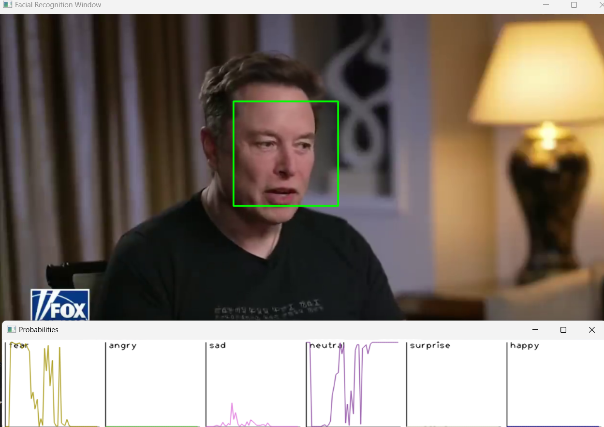

# Facial Expression Recognition

This project implements a facial expression recognition system using Convolutional Neural Networks (CNN) and Visual Transformers (Multi-Head Attention). The FER2013 dataset is augmented using various image processing techniques to improve the model's performance. The final model is exported as an ONNX file for deployment.

## Description
This facial expression recognition system combines the strengths of Convolutional Neural Networks (CNN) and Visual Transformers (Multi-Head Attention). The FER2013 dataset is used as the basis for training and testing, with multiple augmentation techniques applied to improve the model's generalization capabilities.

  
  

### Live Deployment

The live deployment takes the ONNX file and applies it to a live video stream. Faces are detected using Haar cascades, resized to match the model's input dimensions, and then passed through the model. The output is the class (emotion) with the highest probability.

  

### CPP Version

A C++ version of the project compiles everything into a 4 MB executable. It generates a graph of the detected emotions and saves it in JSON format.

  
  
  

### Accuracies & Architecture

  

  

  

  

